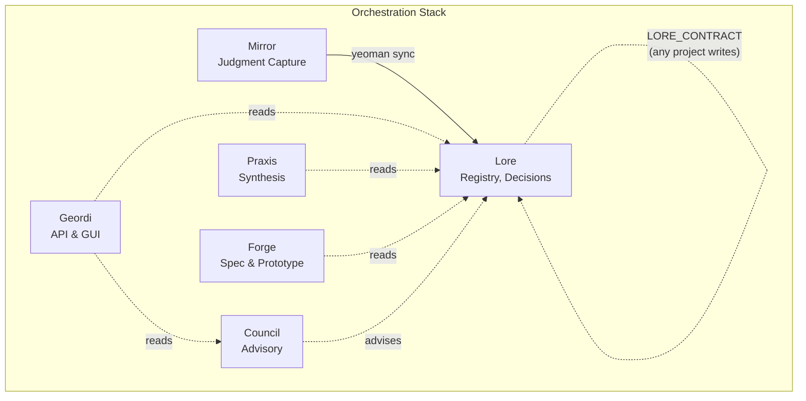

# Contract Boundaries

> Examples reference Mirror and Neo (archived). The contract boundary pattern
> remains valid -- apply it to whatever projects replace them.

Contracts define where projects end and others begin.

## Boundary Diagram

Solid arrows mark formal contracts -- documented schemas, defined envelopes,
explicit ownership. Dashed arrows mark informal reads -- direct file I/O with no
contract governing shape or stability.

## Formal Contracts

### Live

| Contract             | Owner    | Parties    | Defines                      |
| -------------------- | -------- | ---------- | ---------------------------- |
| **LORE_CONTRACT.md** | **Lore** | Any - Lore | Read/write protocol for data |

**LORE_CONTRACT** opens Lore's write path to every project. Decisions go to the
journal. Patterns, failures, observations, and sessions each have defined write
formats. Read access uses search, resume, or graph traversal. Integration stays
optional -- projects work without Lore but lose cross-session memory.

### Archived (Designed, Not Deployed)

| Contract              | Owner   | Location   | Defines                         |
| --------------------- | ------- | ---------- | ------------------------------- |
| SIGNAL_CONTRACT.md    | **Neo** | `cli/neo/` | State schema, signal vocabulary |
| TASK_CONTRACT.md      | **Neo** | `cli/neo/` | Task/result envelopes, workers  |
| CONTAINER_CONTRACT.md | **Neo** | `cli/neo/` | Sandboxed container access      |

Neo's orchestration model required these contracts. The files exist at
`~/dev/cli/neo/` but no runtime consumes them.

## Informal Data Flows

| Flow                | Direction        | Mechanism                        |
| ------------------- | ---------------- | -------------------------------- |
| **Mirror promotes** | Mirror - Lore    | Yeoman bridge (`make sync`)      |
| **Geordi reads**    | Lore - Geordi    | Direct file I/O (JSONL, YAML)    |
| **Geordi reads**    | Council - Geordi | Direct file I/O (markdown, YAML) |
| **Praxis reads**    | Lore - Praxis    | Direct file I/O                  |
| **Forge reads**     | Lore - Forge     | Direct file I/O                  |
| **Council advises** | Council - (all)  | Plan files, initiatives          |

Informal flows carry real dependencies. Geordi breaks if Lore's JSONL format
changes. Praxis breaks if failure journal paths move. These dependencies exist
whether or not a contract governs them.

## The Test

Every arrow between projects has either a contract or an acknowledged informal
dependency. Unlabeled arrows indicate missing contracts or phantom dependencies.
