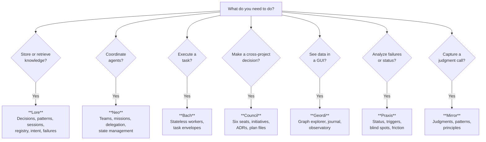

# Decision Flowchart

> Examples reference Neo, Bach, and Mirror (archived). The routing pattern
> remains valid -- apply it to the current active projects.

Every task maps to exactly one project. This flowchart resolves ambiguity.

## Routing

## Quick Reference

| Need                                | Project     | First Command                     |
| ----------------------------------- | ----------- | --------------------------------- |
| Record a decision                   | **Lore**    | `lore remember "..."`             |
| Learn a pattern                     | **Lore**    | `lore learn "..."`                |
| Log a failure                       | **Lore**    | `lore fail ToolError "..."`       |
| Resume previous context             | **Lore**    | `lore resume`                     |
| Search across all knowledge         | **Lore**    | `lore search "..."`               |
| Spawn an agent team                 | **Neo**     | `scripts/plan.sh --init`          |
| Delegate a task to a worker         | **Neo**     | `scripts/execute.sh`              |
| Review a phase                      | **Neo**     | `scripts/review.sh`               |
| Execute a stateless task            | **Bach**    | (receives task envelope from Neo) |
| Choose between approaches           | **Council** | Read `critic/` seat content       |
| Evaluate risk of an action          | **Council** | Read `marshal/` seat content      |
| Track a cross-project initiative    | **Council** | See `initiatives/`                |
| Explore the knowledge graph         | **Geordi**  | `make dev` then /explorer         |
| Browse decisions                    | **Geordi**  | `make dev` then /journal          |
| See project context                 | **Geordi**  | `make dev` then /observatory      |
| Find recurring failures             | **Praxis**  | `praxis triggers`                 |
| Find failures at project boundaries | **Praxis**  | `praxis friction`                 |
| Capture a judgment call             | **Mirror**  | `mirror add`                      |
| Extract patterns from judgments     | **Mirror**  | `mirror patterns`                 |

## Common Confusion Points

| Confusion                          | Resolution                                                                                       |
| ---------------------------------- | ------------------------------------------------------------------------------------------------ |
| "Where do decisions go?"           | Lore journal. Council advises, Lore stores.                                                      |
| "Mirror vs Lore patterns?"         | Mirror captures raw judgments. Lore stores refined patterns. Mirror promotes to Lore via yeoman. |
| "Neo vs Bach?"                     | Neo orchestrates (what to do). Bach executes (does it).                                          |
| "Council vs Neo for coordination?" | Council advises on decisions. Neo coordinates agent teams.                                       |
| "Praxis vs Lore for failures?"     | Lore stores failures. Praxis analyzes them (triggers, friction, blind spots).                    |
